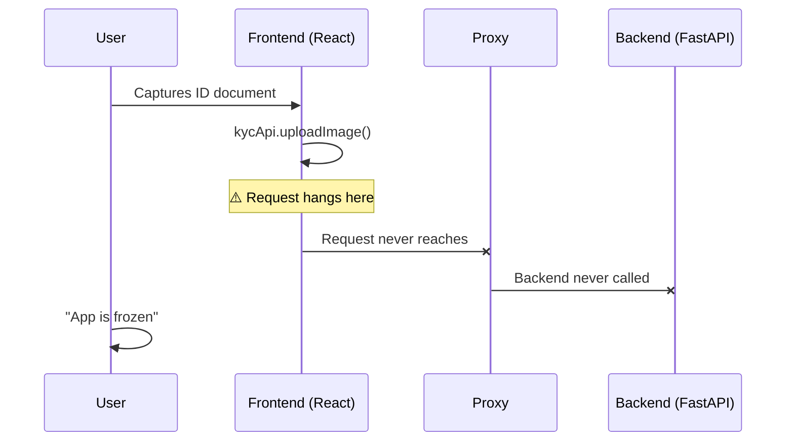

## Introduction

KYC(Know Your Customer) 인증 시스템을 만드는 일은 “그냥 API 몇 개 붙이면 되지 않을까?” 싶었습니다. 하지만 프로덕션에 올라간 순간부터 이야기가 달라졌습니다. 단순한 버그 픽스라고 생각했던 일이, 데이터베이스 스키마, 시스템 라이브러리, 네트워크 설정, 그리고 인프라 전반을 건드리는 3일짜리 디버깅 전쟁으로 번졌습니다.

이 글은 제가 실제로 겪은 **다층(멀티 레이어) 디버깅** 악몽을 기반으로, 같은 상황에서 조금이라도 덜 헤매기 위한 실전 가이드입니다.

## 1. 초기 위기: 테스트 환경 붕괴

### 기반이 무너지는 순간

테스트가 깨졌는데, 흔히 생각하는 “로직 버그”가 아니었습니다. 문제는 카드 탑처럼 여러 층으로 쌓여 있었습니다.

| 문제 | 증상 | 근본 원인 |
|---------|---------|------------|
| DB 에러 | `Table 'face_similarities' doesn't exist` | 마이그레이션 스크립트가 아예 실행되지 않음 |
| CV 크래시 | `libGL.so.1: cannot open shared object file` | 시스템 의존성 누락 |
| GPU 처리 실패 | ONNX Runtime 초기화 실패 | 환경변수 설정 오류 |

### ‘빠른 해결’이 아니었던 빠른 해결

```bash
# Database migration - the obvious first step
uv run alembic upgrade head

# System dependencies - the hidden requirement
sudo apt-get update && sudo apt-get install -y \
    libgl1-mesa-glx \
    libglib2.0-0 \
    libsm6 \
    libxext6 \
    libxrender-dev

# GPU environment configuration
export ONNX_PROVIDERS=CudaExecutionProvider,CPUExecutionProvider
export CUDA_VISIBLE_DEVICES=0
```

**배운 점**: 애플리케이션 코드만 보지 말고, 전체 스택(DB/마이그레이션/시스템 라이브러리/런타임)을 반드시 함께 검증해야 합니다.

---

## 2. 프로덕션의 역설: 테스트는 통과하는데 현실은 실패한다

### 조용한 살인자

테스트는 초록불이었습니다.

```
==================== test session starts ====================
collected 15 items
tests/test_api_endpoints.py .....                          [100%]
==================== 15 passed in 2.3s ====================
```

그런데 프로덕션에서는 완전히 실패했습니다. 사용자는 신분증 업로드 단계를 넘어가지 못했고, 화면은 멈춘 것처럼 보였습니다.

### 보이지 않는 것을 디버깅하기

문제는 프론트엔드와 백엔드 사이의 통신 단절이었습니다.



### 네트워크 설정 미로

3일 동안 네트워크를 추적한 끝에, 결정적인 문제 두 가지를 찾았습니다.

1. **ENUM 대소문자 민감도**: DB에는 `video`가 저장되는데, 코드는 `Video`를 기대
2. **IPv6/IPv4 충돌**: 혼재된 해석으로 인해 타임아웃이 발생

```yaml
# docker-compose.yml - The fix
services:
  frontend:
    environment:
      - VITE_API_URL=http://127.0.0.1:8000  # Force IPv4
      - NODE_ENV=production
    extra_hosts:
      - "host.docker.internal:host-gateway"
```

---

## 3. 인프라 혁명: Windows에서 WSL로

### 권한 지옥의 무한 루프

Docker를 재시작할 때마다 같은 에러가 반복되었습니다.

```
PermissionError: [Errno 13] Permission denied: 'uploads/images'
```

Windows 파일 권한과 Linux Docker 컨테이너가 싸우고 있었고, Windows가 계속 발목을 잡았습니다.

### WSL 승부수

개발 환경 전체를 옮기는 결정을 내렸습니다.

```bash
# Step 1: Enable WSL2
wsl --install -d Ubuntu-24.04

# Step 2: Configure for Docker
echo "[wsl2]" > ~/.wslconfig
echo "memory=4GB" >> ~/.wslconfig
echo "processors=2" >> ~/.wslconfig

# Step 3: Mount with proper permissions
sudo mount -t drvfs '\\wsl$\Ubuntu-24.04' /mnt/wsl
```

### Before / After

| 항목 | Windows | WSL2 |
|--------|---------|------|
| 파일 I/O 성능 | ~100MB/s | ~500MB/s |
| Docker 호환성 | 부분적 | 사실상 네이티브 |
| 권한 이슈 | 상시 발생 | 거의 없음 |
| 개발 경험 | 스트레스 | 부드러움 |

---

## 4. 파일 관리의 깨달음: 세션 기반 아키텍처

### 이전의 혼돈

파일 네이밍이 일관되지 않았습니다.

```
uploads/
├── user_123_card.jpg
├── video_session_456.mp4
├── result_789.json
└── random_upload.png
```

신분증과 얼굴 비디오를 매칭하는 일이 “추측 게임”이 되어버렸습니다.

### 세션 기반 혁명

세션 기반 파일 관리 시스템을 구현했습니다.

```python
# FastAPI Backend - Session Manager
class SessionFileManager:
    def __init__(self, session_id: str):
        self.session_id = session_id
        self.base_path = Path("uploads") / session_id

    def organize_files(self, file_type: str, file_data: bytes):
        """Organize files by session ID and type"""
        self.base_path.mkdir(exist_ok=True)

        file_mapping = {
            "id_card": f"{self.session_id}_card.jpg",
            "face_video": f"{self.session_id}_video.mp4",
            "result": f"{self.session_id}_result.json"
        }

        filename = file_mapping.get(file_type)
        if filename:
            (self.base_path / filename).write_bytes(file_data)

    def trigger_comparison(self):
        """Trigger face comparison when both files exist"""
        if self._has_both_files():
            celery_app.send_task(
                'compare_faces',
                args=[self.session_id]
            )
```

```javascript
// Frontend - Session Tracking
class KYCSession {
    constructor() {
        this.sessionId = this.generateUUID();
        this.files = new Map();
    }

    async uploadFile(type, file) {
        const formData = new FormData();
        formData.append('file', file);
        formData.append('session_id', this.sessionId);
        formData.append('type', type);

        const response = await fetch('/api/upload', {
            method: 'POST',
            body: formData
        });

        this.files.set(type, file.name);
        this.checkReadyForComparison();
    }

    checkReadyForComparison() {
        if (this.files.has('id_card') && this.files.has('face_video')) {
            this.notifyReady();
        }
    }
}
```

---

## 5. 모니터링 개편: 관측 가능성(Observability)은 필수다

### Before: 눈 가리고 운전

프로세스 흐름이 보이지 않았습니다. 사용자가 불만을 제기하면 그제야 로그를 뒤졌습니다.

### After: 완전한 관측 가능성

```python
# Structured Logging with Context
import structlog
logger = structlog.get_logger()

@celery_app.task(bind=True)
def process_kyc_comparison(self, session_id: str):
    """Process face comparison with full logging"""

    with logger.bind(session_id=session_id, task_id=self.request.id):
        logger.info("Starting face comparison process")

        try:
            # Load files
            id_card_path = get_file_path(session_id, "id_card")
            video_path = get_file_path(session_id, "face_video")

            logger.info("Files loaded",
                       id_card=id_card_path,
                       video=video_path)

            # Extract faces
            card_face = extract_face_from_document(id_card_path)
            video_face = extract_face_from_video(video_path)

            logger.info("Faces extracted",
                       card_face_confidence=card_face.confidence,
                       video_face_confidence=video_face.confidence)

            # Compare faces
            similarity = compare_embeddings(card_face.embedding,
                                           video_face.embedding)

            logger.info("Comparison complete",
                       similarity_score=similarity)

            # Save result
            save_result(session_id, {
                "similarity": similarity,
                "verified": similarity > 0.8,
                "processed_at": datetime.utcnow()
            })

        except Exception as e:
            logger.error("Processing failed", error=str(e))
            raise
```

---

## 6. CI/CD 파이프라인: 회귀를 막아라

### 자동화 테스트 스택

```yaml
# .github/workflows/kyc-e2e.yml
name: KYC End-to-End Tests

on:
  push:
    paths:
      - 'Fastapi_worker/**'
      - 'Reactts_frontend/**'

jobs:
  test-kyc-flow:
    runs-on: ubuntu-latest

    services:
      mariadb:
        image: mariadb:10.11
        env:
          MYSQL_ROOT_PASSWORD: test
        options: >-
          --health-cmd="mysqladmin ping"
          --health-interval=10s
          --health-timeout=5s
          --health-retries=3

      redis:
        image: redis:7
        options: >-
          --health-cmd="redis-cli ping"
          --health-interval=10s

    steps:
      - uses: actions/checkout@v4

      - name: Setup Python
        uses: actions/setup-python@v4
        with:
          python-version: '3.11'

      - name: Install dependencies
        run: |
          cd Fastapi_worker
          pip install -e .

      - name: Run migrations
        run: |
          cd Fastapi_worker
          alembic upgrade head

      - name: Start backend
        run: |
          cd Fastapi_worker
          uv run uvicorn app.main:app --host 0.0.0.0 --port 8000 &

      - name: Start frontend
        run: |
          cd Reactts_frontend
          npm ci
          npm run dev &

      - name: Run E2E tests
        run: |
          cd Fastapi_worker
          pytest tests/test_e2e_kyc_flow.py -v
```

---

## 7. 의사결정 프레임워크: 언제 깊게 파고들어야 하나

### 빠른 트러블슈팅 체크리스트

| 증상 | 먼저 확인 | 더 깊게 볼 조건 |
|---------|------------|----------------|
| 업로드 실패 | 파일 권한 | Docker 볼륨 마운트 설정 |
| API 타임아웃 | 네트워크 연결 | 호스트 해석(IPv4/IPv6) |
| CV 크래시 | 라이브러리 버전 | 시스템 의존성 |
| DB 에러 | 커넥션 스트링 | 마이그레이션 상태 |

### 인프라 레드 플래그 🚨

- **재시작마다 권한 에러** → 파일 시스템 호환성 확인
- **dev에서는 되는데 prod에서는 실패** → 환경변수 확인
- **테스트는 통과하는데 현실은 실패** → 네트워크 설정 확인
- **랜덤한 간헐적 실패** → 리소스 제약 확인

---

## Conclusion

프로덕션 시스템 디버깅은 “코드”만의 문제가 아닙니다. DB 스키마부터 시스템 라이브러리, 네트워크 설정, 인프라까지 스택 전체를 이해해야 합니다. 이 여정에서 얻은 핵심 교훈은 다음과 같습니다.

1. **환경 일관성은 협상 불가** - dev/test/prod는 반드시 최대한 동일해야 함
2. **관측 가능성은 선택이 아니다** - 보이지 않으면 고칠 수 없음
3. **인프라 결정은 장기 비용을 만든다** - 신중하게 선택해야 함
4. **자동화 테스트는 현실을 닮아야 한다** - 아니면 “가짜 확신”일 뿐

이제 KYC 시스템은 하루 수천 건의 검증을 안정적으로 처리하고 있습니다. 그리고 더 중요한 건, 다음에 무슨 일이 오더라도 버틸 수 있는 도구와 프로세스를 갖추게 되었다는 점입니다.

### 핵심 정리

```bash
# My debugging mantra
1. Check the foundation first (DB, migrations, system libs)
2. Verify the network (host resolution, protocols)
3. Validate the environment (variables, permissions)
4. Observe everything (logs, metrics, traces)
5. Automate the fixes (CI/CD, infrastructure as code)
```

기억하세요. 버그는 대개 “생각한 곳”에 있지 않습니다. 항상 한 레이어 더 아래를 보세요.

## Additional Resources

- [WSL2 Best Practices](https://learn.microsoft.com/en-us/windows/wsl/setup/environment)
- [Docker in WSL2 Performance Guide](https://docs.docker.com/desktop/wsl/)
- [FastAPI Production Checklist](https://fastapi.tiangolo.com/tutorial/production/)
- [Systematic Debugging Methodology](https://debuggingbook.org/)
